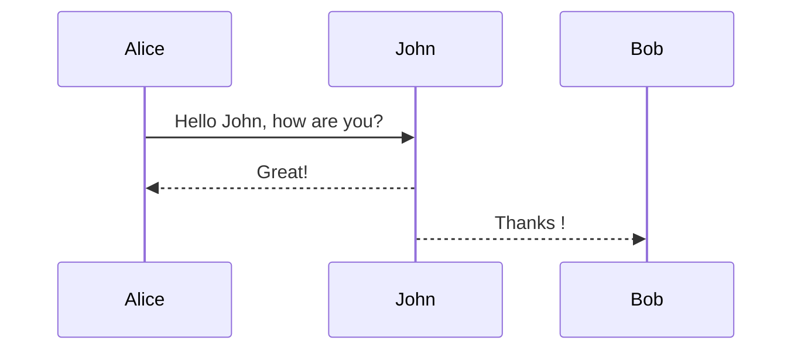

# sous Titre 1

## sous titre 2



### Mat
$\sum_{i=1}^{100} x_{i}$

## Graph

hhhhhh

fffff


# Gant

```mermaid                                                         
pie title Pets adopted by volunteers
    "Dogs" : 386
    "Cats" : 85
    "Rats" : 15
````


# ide 

~~~mermaid 
mindmap
    root(toto)
        a
        b
~~~
